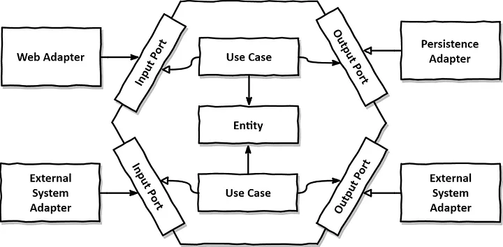

# users-management


* CRUD for users management with FastAPI + MongoDB

From the root directory run the following commands

```bash
docker-compose build
 ```
 
```bash
docker-compose up -d
```

* This project is based in Hexagonal Architecture

.


- Test page for check API
  
http://localhost:8000/

- API DOC

http://localhosts:8000/docs